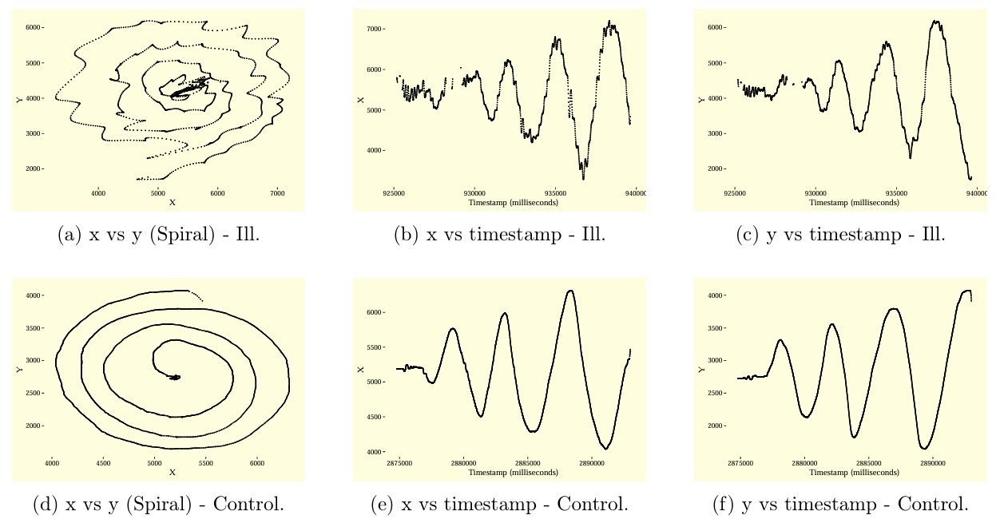
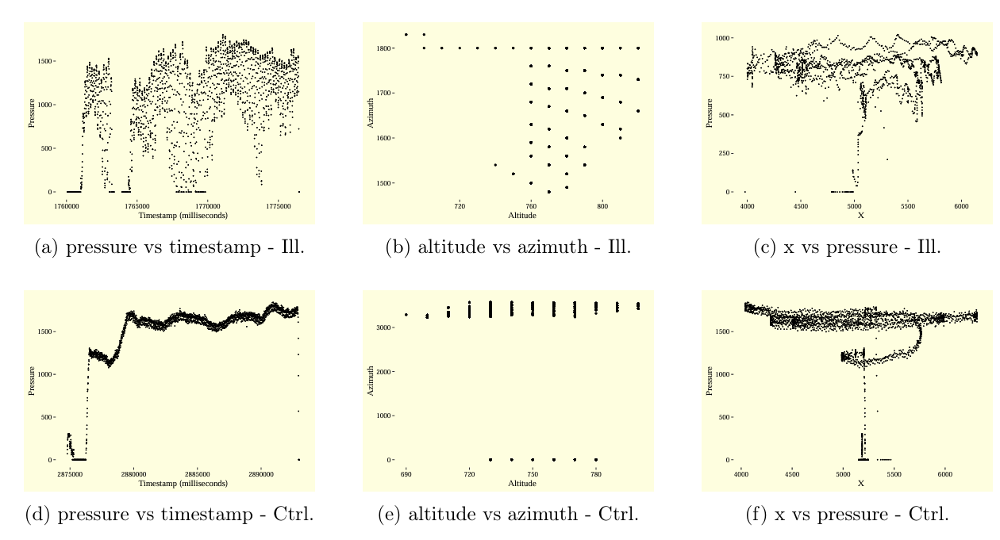
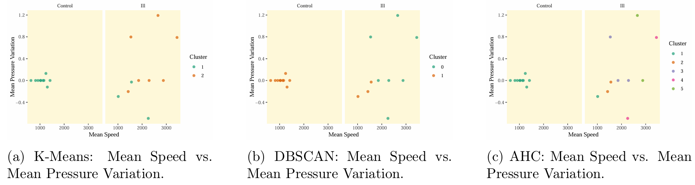
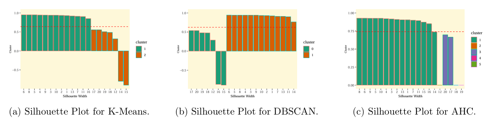

# Spirals: Motion Analysis for Control vs Parkinson’s Patients

This project analyzes **hand-drawn spiral data** collected from both Parkinson’s patients and healthy controls.  
By transforming raw `.svc` stylus signals into interpretable features, we explore how motor control differences manifest in drawing patterns, pen pressure, and kinematics.  

---

## ⚙️ Workflow

1. **Data Preprocessing**
   - Parse `.svc` files → `x, y, timestamp, pen_state, azimuth, altitude, pressure`  
   - Assign patient IDs (`Ill_1`, `Ctrl_2`, …)  
   - Remove timestamp outliers (per patient, IQR rule)  
   - Export cleaned datasets  

2. **Exploratory Data Analysis (EDA)**
   - Spiral drawings (`x vs y`)  
   - Time-series of x, y, pressure, azimuth, altitude vs timestamp  
   - 3D traces (`x, y, timestamp`)  
   - Correlation heatmaps  

3. **Feature Engineering** (per participant)
   - Speed, Acceleration  
   - Direction & Direction Change  
   - Pressure Variation  
   - Total Distance  
   - Avg Active Speed (threshold-based)  
   - CV of Speed, Peak Speed  

4. **Clustering**
   - **K-Means**, **DBSCAN**, **Agglomerative (Ward’s method)**  
   - Cluster validation: Silhouette, Davies–Bouldin, Dunn  
   - External validation: Adjusted Rand Index (ARI) vs Ill/Control labels  

5. **Dimensionality Reduction**
   - PCA (2D projection)  
   - t-SNE visualization  

---
## 📊 Visual Highlights

### Spiral & Motion Plots


Ill subjects show irregular, shaky spirals, while controls show smoother, more uniform curves.  

### Pressure & Pen Dynamics


Parkinson’s patients exhibit higher variability and inconsistency in pressure and pen tilt (azimuth/altitude).  

### Clustering Results


Different algorithms capture motor-control differences to varying degrees.  

### Validation Metrics


Silhouette & ARI indicate reasonable separation between Ill and Control groups.  

---

## 📌 Results at a Glance

| Method        | Avg. Silhouette ↑ | Davies–Bouldin ↓ | Dunn ↑ | Adjusted Rand Index ↑ |
|---------------|------------------|------------------|--------|------------------------|
| **K-Means**   | *0.xx*           | *x.xx*           | *x.xx* | *0.xx*                 |
| **DBSCAN**    | *0.xx*           | *x.xx*           | *x.xx* | *0.xx*                 |
| **AHC (Ward)**| *0.xx*           | *x.xx*           | *x.xx* | *0.xx*                 |

**↑ higher is better, ↓ lower is better**  
*Fill in with your computed values (from silhouette, `intCriteria`, ARI output in Final_Project.R)*  

---
## 🚀 Quick Start

1. Install dependencies in R:

   ```r
   install.packages(c(
     "dplyr","ggplot2","plotly","scatterplot3d","corrplot","tidyr",
     "ggthemes","RColorBrewer","reshape2","dbscan","fpc","clusterCrit",
     "mclust","Rtsne","cluster","dendextend","factoextra","FNN"
   ))

2. Place .svc files under:

    data_new/Ill/
   
    data_new/Control/

4. Run:
   
   ```r
   source("EDA_Merging.R")     # Preprocessing + visualization
   source("Final_Project.R")   # Feature engineering + clustering

---

## 🧠 Key Insights

- Parkinson’s spirals are **irregular and jagged**, compared to smoother control spirals.  
- Pressure and tilt signals show **inconsistency** in patients, suggesting motor instability.  
- Clustering methods (especially **AHC**) separate Ill vs Control reasonably well.  
- **PCA/t-SNE** reveal clear latent structure, with Ill and Control often grouped separately.  

---

## 📈 Applications

- Non-invasive screening for Parkinson’s symptoms via handwriting  
- Feature engineering pipeline for digital pen data  
- Comparative evaluation of clustering methods for biomedical signals  

